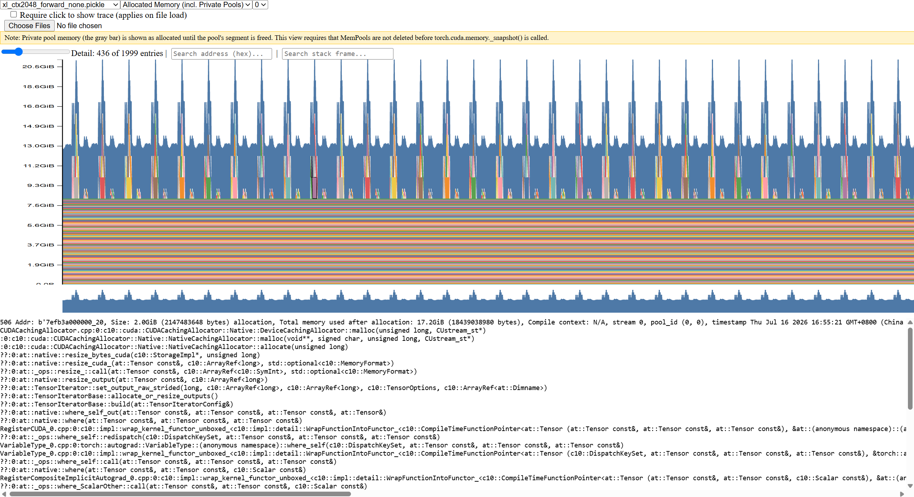
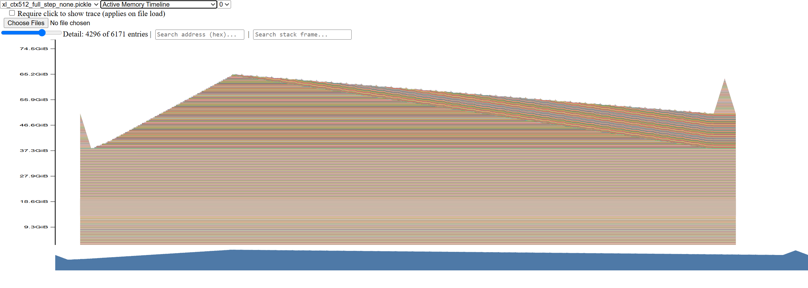

# CS336 Assignment 2 实验报告

**作者：** linyun

**日期：** 2026-07-08。


## 1. benchmark.py

### 1.1 实验设置

本实验使用 NVIDIA GeForce RTX 4090，对 small 和 medium 模型在不同 context length 下的一次完整训练步骤进行性能测试。实验配置为 batch size 4，首先执行5次预热，随后进行10次正式测量。

### 1.2 带 warm-up 实验结果

实验在一张 NVIDIA GeForce RTX 4090（24GB 显存）上进行。模型使用 batch size 4，首先执行5次预热，随后进行10次正式测量。测量结果如下表所示，其中 `--` 表示由于显存不足而未能获得结果。

| 模型 | Context length | Forward（ms） | Backward（ms） | Optimizer（ms） | 运行状态 |
| --- | ---: | ---: | ---: | ---: | --- |
| Small | 256 | $28.841 \pm 0.483$ | $56.182 \pm 2.504$ | $13.002 \pm 0.360$ | 成功 |
| Small | 512 | $28.189 \pm 0.926$ | $55.628 \pm 1.992$ | $12.797 \pm 0.285$ | 成功 |
| Small | 1024 | $72.593 \pm 0.229$ | $150.140 \pm 0.151$ | $12.867 \pm 0.164$ | 成功 |
| Medium | 256 | $57.477 \pm 0.744$ | $109.311 \pm 3.473$ | $40.147 \pm 0.380$ | 成功 |
| Medium | 512 | $75.015 \pm 0.336$ | $155.394 \pm 0.389$ | $39.880 \pm 0.359$ | 成功 |
| Medium | 1024 | -- | -- | -- | OOM |

在当前单卡 RTX 4090 24GB 显存限制下，small 模型能够运行到 context length 1024，而 medium 模型在 context length 1024 时发生显存不足，因此 medium 模型最大成功运行的上下文长度为 512。由于作业要求选择大于 128 的 2 的幂次上下文长度，并尽量选择显存能容纳的最大长度，因此本文报告 small 模型的 256、512、1024 三组结果，以及 medium 模型的 256、512 两组成功结果，并将 medium context length 1024 记为 OOM。

从结果可以看到，反向传播始终是耗时最高的阶段，通常约为前向传播的两倍左右。这是因为反向传播不仅需要计算梯度，还需要沿计算图反向执行大量矩阵乘法和逐元素操作。Optimizer 阶段的耗时主要与模型参数量有关，因此在同一模型规模下，context length 从 256 增加到 1024 时，small 模型的 optimizer 时间基本保持在约 13 ms；medium 模型的 optimizer 时间也基本保持在约 40 ms。

对于 small 模型，context length 从 256 增加到 512 时，forward 和 backward 时间变化不大；但增加到 1024 时，forward 从约 28 ms 增加到约 73 ms，backward 从约 56 ms 增加到约 150 ms。这说明在较短序列长度下，GPU kernel launch、调度开销和 GPU 利用率等因素可能掩盖序列长度增长带来的开销；而当 context length 增加到 1024 后，attention 中与序列长度平方相关的计算和显存访问开销开始明显体现出来。

对于 medium 模型，context length 从 256 增加到 512 时，forward 从约 57 ms 增加到约 75 ms，backward 从约 109 ms 增加到约 155 ms，增长趋势更加明显。整体来看，模型规模和上下文长度都会显著影响训练速度，而显存限制会很快成为更大模型和更长上下文训练的主要瓶颈。

### 1.3改变 Warm-up 次数的实验结果

#### 1.3.1 Warm-up = 0

在不进行预热的情况下，各模型的测量结果如表所示。实验配置保持为 batch size 4、context length 512，并正式测量 10 次。

| 模型 | Forward（ms） | Backward（ms） | Optimizer（ms） |
| --- | ---: | ---: | ---: |
| Small | $61.183 ± 96.309 ms$ | $89.783 ± 70.011 ms$ | $18.812 ± 17.568 ms$ |
| Medium | $110.344 ± 104.606 $ | $170.793 ± 45.651$ | $45.459 ± 16.339 $ |
| Large | $OOM$ | $OOM$ | -- |

与 5 次预热的结果相比，未预热时各阶段的平均耗时普遍更高，标准差也显著增大。其中 Small 和 Medium 模型的 Forward 标准差甚至超过了平均值，说明 10 次测量中存在耗时特别高的初始迭代。

这是因为第一次运行可能包含 CUDA 上下文和动态库初始化、GPU 显存首次分配、内核加载以及 AdamW 状态创建等一次性开销。随着模型重复运行，这些初始化工作不再出现，因此后续迭代明显更快，最终造成较大的测量波动。

#### 1.3.2 Warm-up = 1

执行 1 次预热后的完整训练步骤结果如表所示。实验配置保持为 batch size 4、context length 512，并正式测量 10 次。

| 模型 | Forward（ms） | Backward（ms） | Optimizer（ms） |
| --- | ---: | ---: | ---: |
| Small | $30.890 ± 1.860 ms$ | $55.603 ± 1.019 $ | $12.934 ± 0.350 ms$ |
| Medium | $76.532 ± 4.554 ms$ | $155.708 ± 0.928 ms$ | $40.264 ± 0.316 ms$ |


不进行预热时，测量结果的平均值和标准差都明显增大，例如 Small 模型的 Forward 由 5 次预热后的稳定结果变为 $53.807\pm87.837$ ms，说明初始迭代包含 CUDA 初始化、显存分配、内核加载和 AdamW 状态创建等一次性开销。执行 1 次预热后，大部分一次性开销已经被排除，结果接近 5 次预热，但 Small 模型的波动仍然更大。1～2 次预热可能仍不足以让 GPU 频率、缓存、内存分配器和各类延迟初始化完全稳定，因此使用 5 次预热能得到更加可靠的稳态性能结果。

## 2. benchmark_nvtx.py
### 2.1 nsys 性能分析

为了进一步分析模型前向传播、反向传播和优化器更新中具体的 CUDA kernel 开销，我使用 NVIDIA Nsight Systems 进行 profile。由于已经在代码中手动添加了 NVTX 标记，因此本实验没有启用 PyTorch 自动函数级 trace，以避免大量额外 trace 事件带来的 profiler 开销。

一个示例的 nsys 命令如下，实际批量运行命令放在 `run_all_nsys.sh` 中。

```bash
nsys profile \
	--trace=cuda,nvtx,cudnn,cublas,osrt \
	--sample=none \
	--cpuctxsw=none \
	--output=reports/small_ctx512_full_step_light \
	--force-overwrite=true \
	-- python benchmark_nvtx.py \
	--model-size small \
	--context-length 512 \
	--mode full_step \
	--warmup-steps 5 \
	--measurement-steps 10
```

其中，`--trace=cuda,nvtx,cudnn,cublas,osrt` 表示采集 CUDA、NVTX、cuDNN、cuBLAS 以及操作系统运行库相关事件。`--sample=none` 用于关闭 CPU IP/backtrace sampling，`--cpuctxsw=none` 用于关闭线程上下文切换采集。这样可以避免在当前服务器环境中由于权限限制产生 CPU 采样错误，同时也能减少 profiler 的额外开销。

在 benchmark 代码中，我手动添加了如下 NVTX 区间：

- `my_train_step`：一次完整训练步骤；
- `my_forward`：前向传播；
- `my_cross_loss`：交叉熵损失计算；
- `my_backward`：反向传播；
- `my_optimizer_step`：AdamW 参数更新；
- `my_attention_scores_matmul`、`my_attention_softmax`、`my_attention_value_matmul`：self-attention 内部的主要子步骤。

在 Nsight Systems GUI 中，我通过对对应的 NVTX 区间使用 `Apply to Filter`，再查看 `Stats System View` 中的 `CUDA GPU Kernel Summary`，从而统计指定阶段内部的 CUDA kernel 累计时间。

### 2.2 实验结果分析

#### (a) What is the total time spent on your forward pass? Does it match what we had measured  before with the Python standard library?

根据 Python 标准库计时结果，small 模型在 context length 为 256、512、1024 时的前向传播平均耗时分别为：

$$
28.841\ \text{ms},\quad 28.189\ \text{ms},\quad 72.593\ \text{ms}.
$$

在去掉 PyTorch 自动函数级 trace 后，Nsight Systems 中 `my_forward` NVTX 区间显示的耗时与 Python 标准库测量结果基本一致。经过在small和medium上的比对，前者仅比后者多出几微秒，几乎可以忽略不计。值得一提的是，此前开启 `--pytorch=functions-trace,autograd-shapes-nvtx` 时，forward 区间耗时明显增大，这是因为 PyTorch 函数级 tracing 会插入大量额外 NVTX 事件和记录开销，导致 profiler 本身显著影响运行时间；也导致两种方法测量出来的结果有所偏差。

#### (b) What CUDA kernel takes the most cumulative GPU time during the forward pass? How  many times is this kernel invoked during a single forward pass of your model? Is it the same kernel that takes the most runtime when you do both forward and backward passes? (Hint: look at the “CUDA GPU Kernel Summary” under “Stats System View”, and filter using NVTX ranges to identify which parts of the model are responsible for which kernels.)

为了回答该问题，我在 Nsight Systems GUI 中对单次 `my_forward` NVTX 区间应用 filter，然后查看 `CUDA GPU Kernel Summary`，并按照 `Total Time` 降序排序。

在small和meidum模型中，246contex下，前向传播中累计 GPU 时间最高的 CUDA kernel 是：ampere_sgemm_128x64_tn。

small和medium中：分别调用85次和168次；backward阶段累计最长的是void cutlass::Kernel2<cutlass_80_simt_sgemm_128x256_8x4_nt_align1>(T1::Params)，都是矩阵通用乘法（GEMM），但有些许不同暂且按下不表。

这里有个奇怪的地方，为啥small模型ampere_sgemm_128x64_tn总调用耗时约7ms，而软件给出了70%的占比——大概是因为软件统计的只是gpu的时间，gpu真正跑kernal的时间可能就10ms，剩下的开销是kernel launch、cpu调度等开销。

#### (c) Although the vast majority of FLOPs take place in matrix multiplications, you will notice  that several other kernels still take a non-trivial amount of the overall runtime. What other kernels besides matrix multiplies do you see accounting for non-trivial CUDA runtime in the forward pass?

用时最多的是这些内存密集型的内核，逐元素处理，很滑稽的是lauch这个kernal的时间可能比kernal本身的时间还要长。
- `at::native::elementwise_kernel`；
- `at::native::vectorized_elementwise_kernel`；
此外可能还有些计算相关的内核：
- reduction 相关 kernel；
- softmax 相关 kernel；
- cuBLASLt 的 split-K reduction kernel。

虽然这些操作的 FLOPs 远少于矩阵乘法，但它们往往受到显存带宽、kernel launch 开销和访存模式的影响，因此仍然会占据一定的运行时间。

#### (d) Profile running one complete training step with your implementation of AdamW (i.e., the  forward pass, computing the loss and running a backward pass, and finally an optimizer step, as you’d do during training). How does the fraction of time spent on matrix multiplication change, compared to doing inference (forward pass only)? How about other kernels?
我观察到，更换为官方的AdamW实现（比较拉的实现，有不少不必要的中间变量等）后：backward的耗时没变，optimizer的耗时增加了200%(原来平均大约是12，现在是36ms)，forward的耗时略微增加了约1ms。这很合理，毕竟优化器变拉了。

矩阵乘法运算量的比较：在small模型中，推理（forward）矩阵乘法占比高达约70%，放在一个完整的训练步则只有54%，因为反向传播和优化器步骤有大量的Elementwise内核开销，矩阵乘法的影响降低；而在medium模型中，推理（forward）矩阵乘法占比约为56%，放在一个完整的训练步则只有约57%，甚至有所增长，因为维度的增长导致矩阵乘法的开销增长了

Elementwise内核：自定义优化器的Elementwise内核调用次数高达万级别，而官方的少很多（大概两三千），官方可能做了些什么操作融合，内核启动和开销和内存分配都更好。

##### (e) Compare the runtime of the softmax operation versus the matrix multiplication operations  within the self-attention layer of your model during a forward pass. How does the difference in runtimes compare to the difference in FLOPs?

在 self-attention 层内部，我分别对 attention score 矩阵乘法、softmax 和 value 矩阵乘法添加了 NVTX 标记：

- `my_attn_scores`：计算 $QK^\top$；
- `my_attn_softmax`：对 attention scores 计算 softmax；
- `my_attn_output`：计算 $\mathrm{softmax}(QK^\top)V$。

基于small的512上下文：my_attn_scores = 58.810 μs，my_attn_softmax = 126.358 μs，my_attn_output = 120.647 μs

各阶段的额FLOPS：
| 操作               | 输入输出形状                                         | FLOPs 量级                   |
| ---------------- | ---------------------------------------------- | -------------------------- |
| `QK^T`           | `[B,H,L,d_head] @ [B,H,d_head,L] -> [B,H,L,L]` | `2 * B * H * L^2 * d_head` |
| `softmax`        | `[B,H,L,L] -> [B,H,L,L]`                       | `O(B * H * L^2)`           |
| `softmax(QK^T)V` | `[B,H,L,L] @ [B,H,L,d_head] -> [B,H,L,d_head]` | `2 * B * H * L^2 * d_head` |

可以看到，虽然 softmax 的 FLOPs 量级远低于矩阵乘法，但在实际运行中，softmax 的耗时却明显高于矩阵乘法。这是因为 softmax 涉及max、exp、sum、divide等操作，访存和同步开销明显，不像高度优化的GEMM那样可以重复利用计算能力。

## 3. benchmarking_mixed_precision.py

### mixed_precision_accumulation实验
充分说明了，浮点数其实不是精确表示小数的，尤其是float16，累加误差会很大。而且从16转到32并没有用，因为在0.01用f16表示的时候，精度就已经损失掉了。
```python
s = torch.tensor(0, dtype=torch.float32)
for i in range(1000):
    s += torch.tensor(0.01, dtype=torch.float32)
print(s)	# 10.0

s = torch.tensor(0, dtype=torch.float16)
for i in range(1000):
    s += torch.tensor(0.01, dtype=torch.float16)
print(s)

s = torch.tensor(0, dtype=torch.float32)
for i in range(1000):
    s += torch.tensor(0.01, dtype=torch.float16)
print(s)

s = torch.tensor(0, dtype=torch.float32)
for i in range(1000):
    x = torch.tensor(0.01, dtype=torch.float16)
    s += x.type(torch.float32)
print(s)

# tensor(10.0001)
# tensor(9.9531, dtype=torch.float16)
# tensor(10.0021)
# tensor(10.0021)
```
### benchmarking_mixed_precision
#### Suppose we are training the model on a GPU and that the model parameters are originally in FP32. We’d like to use autocasting mixed precision with FP16. What are the data types of:
很合理。除了fc和输出这种涉及到矩阵乘法的，感觉大部分还是要保持在32，比如梯度和损失这种对精度比较敏感的。
- 原模型参数是32的
- fc1是16的
- layernorm是32的
- 输出的logits是16的
- loss是32的
- gradient是32的

#### You should have seen that FP16 mixed precision autocasting treats the layer normalization  layer differently than the feed-forward layers. What parts of layer normalization are sensitive to mixed precision? If we use BF16 instead of FP16, do we still need to treat layer normalization differently? Why or why not?
layernorm要做mean、var、devide等操作，这些操作对精度比较敏感，所以layernorm要保持在32位。BF16动态范围和FP32一样，但是精度还是低，仍然存在累计误差，所以最好还是用32

#### Modify your benchmarking script to optionally run the model using mixed precision with  BF16. Time the forward and backward passes with and without mixed-precision for each language model size described in Section 2.1.2. Compare the results of using full precision versus mixed precision, and comment on any trends as model size changes. You may find the nullcontext no-op context manager to be useful.

| 模型     | Precision |   Forward (ms) |   Backward (ms) | Optimizer (ms) | Forward 变化 | Backward 变化 | Optimizer 变化 |
| ------ | --------- | -------------: | --------------: | -------------: | ---------: | ----------: | -----------: |
| Small  | FP32      | 28.189 ± 0.926 |  55.628 ± 1.992 | 12.797 ± 0.285 |   baseline |    baseline |     baseline |
| Small  | BF16 混合    | 34.089 ± 1.186 |  62.152 ± 3.383 | 12.908 ± 0.105 |    慢 20.9% |     慢 11.7% |       慢 0.9% |
| Medium | FP32      | 75.015 ± 0.336 | 155.394 ± 0.389 | 39.880 ± 0.359 |   baseline |    baseline |     baseline |
| Medium | BF16 混合    | 68.966 ± 1.670 | 122.797 ± 2.620 | 40.163 ± 0.685 |     快 8.1% |     快 21.0% |       慢 0.7% |

nsys分析：
1. 混合精度的kernal第一是ampere_bf16_s1688gemm_bf16_64x64_sliced1x4_ldg8_f2f_tn，bf16的矩阵乘法，即使第一总耗时也比较少，很快（这是很正常的，gpu为bf16提供的计算要快得对多）。

2. 第二是vectorized_elementwise_kernel::bfloat16_copy_kernel_cuda，这说明 mixed precision 引入了额外 dtype conversion / copy 开销。这正好解释前面 small 模型为什么变慢：small 模型里 GEMM 加速收益不够大，反而被 autocast/copy/type conversion 开销抵消；这个对更大的模型有效。

3. 第三是虽然bp16会让矩阵乘法变快但是attention里的几个操作甚至更慢了；可能这种小规模 attention matmul还不够。

## 4. answers for 2.1.6 memory profile

### 实验设置
参考run_memory_profiles.sh，在pro6000(96GB)上运行，共八种版本：128和2048的context length，forward和full_step两种模式，none和bf16两种精度。每个版本运行一次完整训练步骤，记录显存使用情况。

### 实验结果

#### Add an option to your profiling script to run your model through the memory profiler.  It may be helpful to reuse some of your previous infrastructure (e.g., to activate mixed-precision, load specific model sizes, etc). Then, run your script to get a memory profile of the xl model when either doing inference only (just forward pass) or a full training step.** What do your memory timelines look like? Can you tell which stage is running based on the peaks you see?**

首先，即使是在 pro6000 96GB 显存上，2048 的 context length 也无法运行 full_step，forward 可以运行。128 的 context length 可以运行 full_step。128的forward内存图几乎就是平缓的，因为attention的L×L张量只有128×128，显存开销不大，仅有8MB左右。

而2048，在仅执行forward时，显存时间线呈现约 32 个周期性峰值，分别对应 xl 模型的 32 个 TransformerBlock；这些峰值主要来自每层 attention 中临时创建的大型 L×L 张量，并在该层计算结束后被释放。

完整训练步骤的时间线中，前向传播阶段会逐层保存反向传播所需的激活，因此显存整体上升；随后在反向传播阶段，这些激活逐层释放并产生梯度，而优化器阶段则会访问或更新参数及其状态。由周期性 attention 峰值、显存累积以及随后释放的变化，可以大致区分 forward、backward 和 optimizer 阶段。

由于跑不了2048的full_step(1024的也跑不了)，所以这里只放2048的forward和512的full_step的显存时间线图。
可以很明显地观察到32个峰值：


可以观察到显存不断地上升累积，因为要保存激活值用作反向传播，到了反向传播，保存的**激活值（一些中间结果）**被释放，但与此同时又会生成参数梯度，所以显存会缓慢下降。最后那个尖峰是optimizer阶段的显存峰值：



#### What is the peak memory usage of each context length when doing a forward pass? What  about when doing a full training step?
以下都是全精度的：
| Context length | Forward-only peak memory (GiB) | Full training step peak memory (GiB) |
|---:|---:|---:|
| 128  | 12.91 | 63.13 |
| 512  | 13.44 | 65.54 |
| 1024  | 15.6 | OOM |
| 2048 | 21.30 | OOM |

全精度下模型参数约12.5 GiB，forward阶段，多余的激活值随着上下文占用从0.41-8.8 GiB不等，大致可以理解为随着上下文长度增加有一个二次增长（不严格的）；反而是全阶段的显存占用几乎不随上下文长度变化，主要是因为全阶段的显存占用主要来自模型参数和优化器状态，而这些在不同上下文长度下基本保持不变。

####  Find the peak memory usage of the xl model when using mixed-precision, for both a forward pass and a full training step. Does mixed-precision significantly affect memory usage?

以下都是bf16精度的：
| Context length | Forward-only peak memory (GiB) | Full training step peak memory (GiB) |
|---:|---:|---:|
| 128  | 19.14 | 63.31 |
| 512  | 19.40 | 63.72 |
| 1024  | 20.63 | OOM |
| 2048 | 25.35 | OOM |

这就很诡异了，混合精度竟然完全没有节省显存，甚至还有副作用！BF16反而比 FP32高，主要是 autocast 保留原始 FP32参数，同时缓存转换后的 BF16权重副本。这个缓存大约增加6 GiB，和结果中的差值基本吻合。

#### Consider the xl model. Given our reference hyperparameters, what is the size of a tensor of activations in the Transformer residual stream, in single-precision? Give this size in MiB (i.e., divide the number of bytes by 1024^2).

For the XL model, a residual-stream activation has shape $4×2048×2560$. In FP32, its size is $4×2048×2560×4/1024^2=80 MiB$.

所谓的残差流，就是transformer中每一层的主干x，每一层的x都会加上残差连接，作为下一层的输入。

#### Now look closely at the “Active Memory Timeline” from pytorch.org/memory_viz of a memory snapshot of the xl model doing a forward pass. When you reduce the “Detail” level, the tool hides the smallest allocations to the corresponding level (e.g., putting “Detail” at 10% only shows the 10% largest allocations). What is the size of the largest allocations shown? Looking through the stack trace, can you tell where those allocations come from?

以2048的forward为例，显存时间线中最大的分配约为2.0GB。


最大单次分配计算，4个batch，32个头，每个头都有一个2048^2的score，总共就是：
$$
\frac{4\times32\times2048\times2048\times4}{1024^3}
=2\ \text{GiB}
$$
看Stack trace可发现：最上面是malloc和allocate的内存操作，然后到一些算子，再到pytorch api；还有个发现是，不仅torch.where、torch.masked_fill、torch.softmax甚至一个减法操作都可能会产生一个新的张量，都会有一次malloc和allocate的内存分配——他这个attention的实现是很不高效的。且它这个复杂度是O(L^2)，理论上QKV可以分块计算再累计，可以降低显存复杂度。


#### ...Does the result match what you expect?

- 环境：XL、batch size 4、context length 128、FP32。单个 TransformerBlock forward：`41.01 → 41.17 GiB`。 保存的激活近似为：$
  (41.17-41.01)\times1024\approx164\text{ MiB}$
- 单个 TransformerBlock backward：`50.05 → 50.35 GiB`。backward 净增加：$(50.35-50.05)\times1024\approx307\text{ MiB}$
- 根据“释放 saved tensors，同时生成梯度”的关系，梯度估算为：
  $$
  164+307\approx471\text{ MiB}
  $$
- 误差来源：Nsight 读数精度、区间边界、PyTorch caching allocator，以及 profiler 自身开销。
- 五个最大贡献操作：暂缺，找了半天也没在nsys gui里找到


## 3. Single-GPU Memory
梯度检查点（gradient checkpointing），也称为激活检查点（activation checkpointing），降低显存占用。
### 3.1 Autograd Residuals

为了能自动求导，其实PyTorch在前向传播时会保存一些中间结果（residuals），这些中间结果在反向传播时会被使用。

详细的可以看看scripts/autograd_experiment.py，一个简单的RMS操作中间产生了大量的saved tensor，导致显存占用大幅增加——这也就是为什么训练需要的显存远不止模型参数，还要包括参数梯度、优化器状态、forward 为 backward 保存的激活 + 临时张量。

其中 saved tensors 往往占用大量显存。
后面的技术都是在处理这个问题：
- 算子融合：减少不必要的中间结果和重复保存。
- Activation checkpointing：不保存所有激活，backward 时重新计算。
- FlashAttention：避免保存巨大的完整 attention 矩阵。
- 混合精度：让部分张量使用更少字节。
- FSDP/分片：把参数、梯度和优化器状态分散到多张 GPU。

#### 3.1.1 Operator Fusion
算子融合后，冗余的saved tensor会被消除，显存占用降低。但是必要的参数权重还是不变的。

### 3.2 Activation Checkpointing
#### 3.2.1 Recomputation 
Consider a Transformer with **N** identical blocks stacked sequentially. Without any checkpointing, all N blocks’ worth of residuals are kept alive simultaneously, giving O(N ) peak activation memory. We have a free hand to wrap any subset of the forward pass in checkpoint, including nesting checkpoint calls inside one another. 

(a) **What checkpointing strategy minimizes peak activation memory**, ignoring the compute cost?  Describe how you would arrange the checkpoint calls (a code sketch is fine), and give the asymptotic peak activation memory and compute of your strategy as a function of N . Assume the residuals saved by a single block dominate any per-checkpoint bookkeeping.  Deliverable: A 3-5 sentence description of the strategy and its asymptotic peak memory, plus a short code sketch.

**显存的峰值取决于有多少 checkpoint 输入张量同时真实保存在 GPU 上**。所以虽然可以为每个 TransformerBlock 都做 checkpoint，此时为一个32叉子树，深度为1。但这样会导致所有的 checkpoint 输入张量同时保存在 GPU 上，显存峰值仍然是 O(N)。大约峰值为$32\times 160MB + 3.65GB \approx 8.5GB$。

而理论最优是，二分递归地对 TransformerBlock 做 checkpoint，形成一个二叉树，深度为 log2(N)。每次递归只保留当前 checkpoint 的输入张量，其他的 checkpoint 输入张量在递归返回时被释放。这样显存峰值为 O(log N)，大约峰值为$5\times 160MB + 3.65GB \approx 4.45GB$。注意，递归的逻辑checkpoint是不少的，只不过活跃checkpoint输入张量的数量是 log2(N) 个。

```python 
from torch.utils.checkpoint import checkpoint


def recursive_checkpoint(blocks, x):
    n = len(blocks)

    # 递归终点：只剩一个 TransformerBlock
    if n == 1:
        return blocks[0](x)

    mid = n // 2
    left_blocks = blocks[:mid]
    right_blocks = blocks[mid:]

    # 对左半部分递归 checkpoint
    x = checkpoint(
        lambda hidden: recursive_checkpoint(left_blocks, hidden),
        x,
        use_reentrant=False,
    )

    # 对右半部分递归 checkpoint
    x = checkpoint(
        lambda hidden: recursive_checkpoint(right_blocks, hidden),
        x,
        use_reentrant=False,
    )

    return x
```

(b) Consider the xl model config with batch size 4 and sequence length 2048 as above. If you only  have the time/compute budget to run one step of recomputation (meaning you may not nest checkpoint calls), what is the best checkpointing strategy to reduce peak memory? Profile your run’s peak memory to validate your hypothesis. Compare the peak memory of the next smaller and larger checkpointing block sizes to be sure.

既然只能重计算一次，那最优答案就是每个block都分一个ckp；但实际表现如何，开启下列实验，先做个小规模的验证：

```bash
python benchmark_checkpoint.py \
      --model-size medium \
      --context-length 512 \
      --batch-size 4 \
      --num-checkpoints 6 \
      --warmup-steps 2 \
      --measurement-steps 3
```


